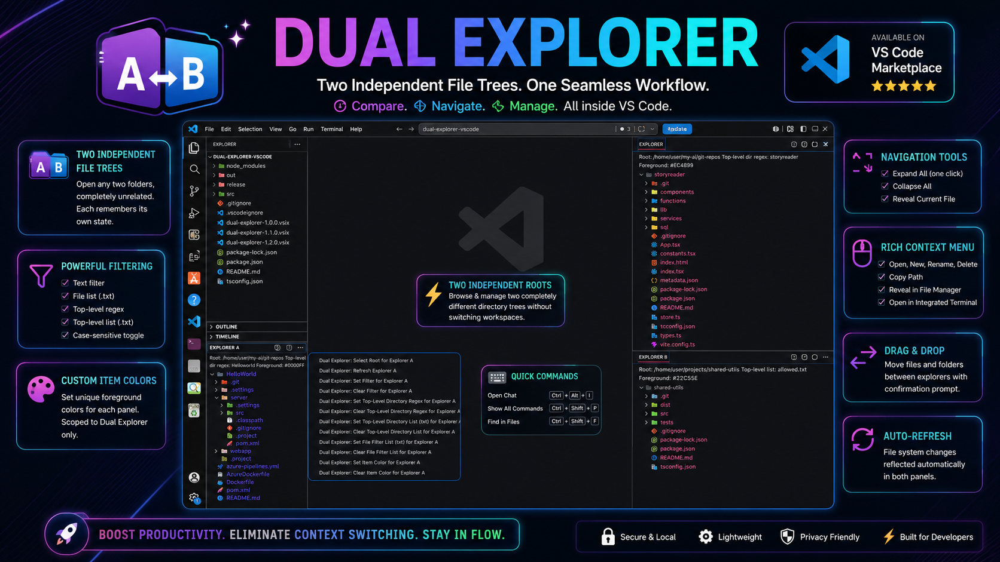

# Dual Explorer for VS Code

Browse two completely independent file trees inside the VS Code Explorer sidebar — each with its own root, filters, colors, and persistent state.



---

## Features

- **Two independent explorer panels** — Explorer A and Explorer B each have their own root folder, expansion state, selection, and filter settings.
- **Persistent state** — root, filters, color, and expanded/selected items are all restored automatically when VS Code restarts.
- **File filtering** — filter visible files by text, wildcard pattern, or a `.txt` allow-list.
- **Top-level directory filtering** — restrict the top-level folders shown using a regex pattern or a `.txt` allow-list.
- **Per-explorer color theming** — set a custom hex foreground color for items in each panel independently.
- **Full file operations** — create files/folders, rename, delete (with confirmation), copy path, reveal in OS, open in integrated terminal.
- **Drag and drop** — move files and folders within an explorer or across Explorer A ↔ B (with confirmation prompt).
- **Multi-select delete** — select multiple items and delete them in one action.
- **Expand All / Collapse All** — expand or collapse the entire tree with a single command.
- **Reveal current file** — jump to the active editor's file in either explorer.
- **Auto-refresh** — each explorer watches the file system and refreshes automatically on changes.
- **Status message** — each panel header shows the active root, filter, and color at a glance.

---

## Getting Started

1. Open the **Explorer** sidebar (`Ctrl+Shift+E`).
2. Scroll down to find **Explorer A** and **Explorer B** panels.
3. Click the toolbar icon or run **Dual Explorer: Select Root for Explorer A** (and/or B) to pick a root folder.

The root, filter, and color choices persist across VS Code restarts — no setup needed again.

---

## File Filtering

File filters apply only to files (directories are always shown).

### Text / Wildcard Filter

Run **Dual Explorer: Set Filter for Explorer A** (or B). Enter:

| Input | Matches |
|-------|---------|
| `config` | any filename containing `config` |
| `*.ts` | filenames ending in `.ts` |
| `*.test.*` | filenames matching that wildcard pattern |

Filtering is case-insensitive by default. Enable case-sensitive matching via the setting `dualExplorer.filter.caseSensitive`.

### File Filter List (`.txt`)

Run **Dual Explorer: Set File Filter List (txt) for Explorer A** (or B) and choose a plain-text file. Each line is an exact filename to allow (e.g. `index.ts`). Only files whose name exactly matches an entry in the list are shown.

The text filter and the file filter list are **both applied** when both are active — a file must match both.

---

## Top-Level Directory Filtering

Top-level directory filters restrict which **root-level folders** appear in the tree. Sub-folders inside are unaffected.

### Regex Filter

Run **Dual Explorer: Set Top-Level Directory Regex for Explorer A** (or B). Enter any valid JavaScript regex, e.g. `^feature-` to show only folders whose name starts with `feature-`.

### Directory List (`.txt`)

Run **Dual Explorer: Set Top-Level Directory List (txt) for Explorer A** (or B) and choose a plain-text file. Each line is a folder name to allow at the root level.

The regex and directory list filters are **both applied** when both are active.

---

## Color Theming

Each explorer panel can have its own item text color.

Run **Dual Explorer: Set Item Color for Explorer A** (or B) and enter a 6-digit hex color (e.g. `#d4e8c2`). The color is saved globally in `workbench.colorCustomizations` and persists across sessions.

Run **Dual Explorer: Clear Item Color** to reset to the default theme color.

The underlying color tokens that can also be set directly in `settings.json`:

```json
"workbench.colorCustomizations": {
  "dualExplorer.explorerAForeground": "#d4e8c2",
  "dualExplorer.explorerBForeground": "#c2d4e8"
}
```

---

## File Operations

Right-click any item in either explorer:

| Action | Available on |
|--------|-------------|
| New File | Folders |
| New Folder | Folders |
| Rename | Files and folders |
| Delete | Files and folders (moves to trash, supports multi-select) |
| Copy Path | Files and folders |
| Reveal in File Explorer | Files and folders |
| Open in Integrated Terminal | Files (opens at parent folder) and folders |

---

## Drag and Drop

Items can be dragged within Explorer A, within Explorer B, or **across** Explorer A ↔ B. Dropping onto a folder moves the item(s) into that folder. A confirmation prompt is shown before any move is performed.

---

## Commands

All commands are available via the Command Palette (`Ctrl+Shift+P`):

**Root**
- `Dual Explorer: Select Root for Explorer A`
- `Dual Explorer: Select Root for Explorer B`

**Refresh**
- `Dual Explorer: Refresh Explorer A`
- `Dual Explorer: Refresh Explorer B`
- `Dual Explorer: Refresh All`

**File Filter**
- `Dual Explorer: Set Filter for Explorer A`
- `Dual Explorer: Set Filter for Explorer B`
- `Dual Explorer: Clear Filter for Explorer A`
- `Dual Explorer: Clear Filter for Explorer B`
- `Dual Explorer: Set File Filter List (txt) for Explorer A`
- `Dual Explorer: Set File Filter List (txt) for Explorer B`
- `Dual Explorer: Clear File Filter List for Explorer A`
- `Dual Explorer: Clear File Filter List for Explorer B`

**Top-Level Directory Filter**
- `Dual Explorer: Set Top-Level Directory Regex for Explorer A`
- `Dual Explorer: Set Top-Level Directory Regex for Explorer B`
- `Dual Explorer: Clear Top-Level Directory Regex for Explorer A`
- `Dual Explorer: Clear Top-Level Directory Regex for Explorer B`
- `Dual Explorer: Set Top-Level Directory List (txt) for Explorer A`
- `Dual Explorer: Set Top-Level Directory List (txt) for Explorer B`
- `Dual Explorer: Clear Top-Level Directory List for Explorer A`
- `Dual Explorer: Clear Top-Level Directory List for Explorer B`

**Navigation**
- `Dual Explorer: Expand All in Explorer A`
- `Dual Explorer: Expand All in Explorer B`
- `Dual Explorer: Collapse All in Explorer A`
- `Dual Explorer: Collapse All in Explorer B`
- `Dual Explorer: Reveal Current File in Explorer A`
- `Dual Explorer: Reveal Current File in Explorer B`

**Color**
- `Dual Explorer: Set Item Color for Explorer A`
- `Dual Explorer: Set Item Color for Explorer B`
- `Dual Explorer: Clear Item Color for Explorer A`
- `Dual Explorer: Clear Item Color for Explorer B`

---

## Settings

| Setting | Type | Default | Description |
|---------|------|---------|-------------|
| `dualExplorer.filter.caseSensitive` | boolean | `false` | Use case-sensitive matching for file filters. |

---

## Requirements

VS Code **1.89.0** or later.

---

## Development

```bash
npm install
npm run compile      # one-time build
npm run watch        # rebuild on change
npm run package:vsix # produce .vsix
```

Press `F5` in VS Code to launch an Extension Development Host with the extension loaded.
